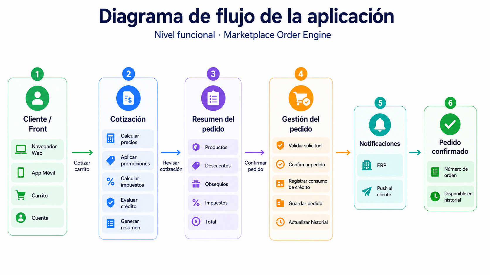
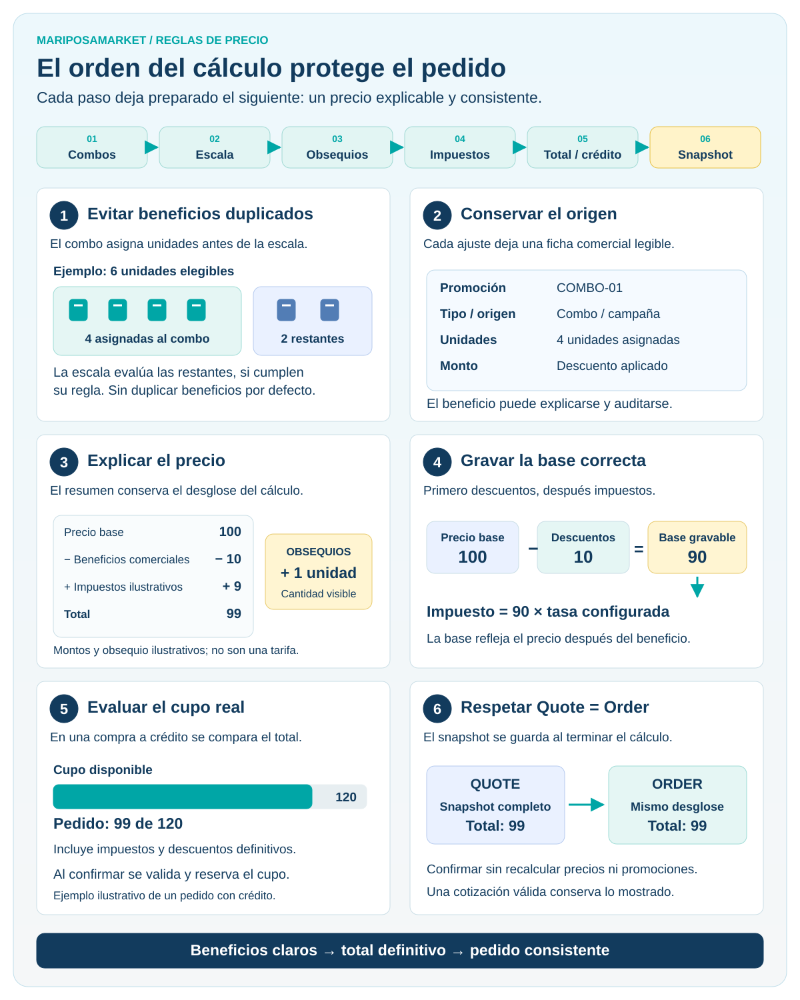
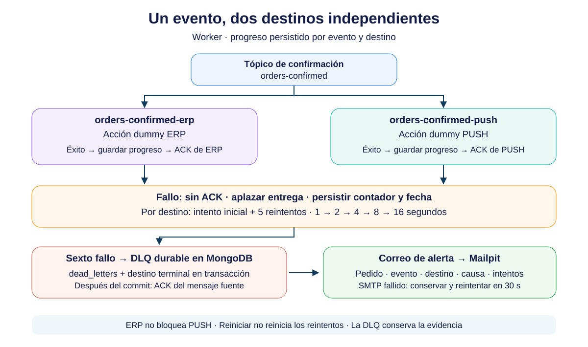

# Prueba Técnica Tech Lead — Discovery y Diseño de Solución

[MariposaMarket · ADR de una página](adr.html) · [Descargar PDF](ADR.pdf)

## Marketplace B2B Multi-tenant — Motor de Precios y Confirmación de Pedidos

> **Objetivo del documento**
> Consolidar el Discovery funcional y técnico de la solución propuesta para la prueba técnica: problema, flujo funcional, journey del cliente, dominio y reglas de negocio, casos de uso, estrategia de pruebas, casos golden, orden de aplicación de palancas comerciales y stack tecnológico.

---

# 1. Descripción del problema

La plataforma corresponde a un **marketplace B2B multi-tenant** donde tenderos compran productos a distribuidores de bebidas.

El journey principal de compra es:

```text
Catálogo → Carrito → Checkout / Cotización → Confirmación → Historial
```

Sobre un mismo pedido pueden coexistir distintas **palancas comerciales**:

- Descuento por escala.
- Combo.
- Obsequio.
- Impuestos.
- Cupo de crédito.

La solución debe resolver dos problemas principales:

## 1.1. Motor de cálculo del pedido

Dado un carrito y un conjunto de reglas comerciales vigentes, el sistema debe calcular:

- Subtotal bruto.
- Descuentos aplicados.
- Origen de cada descuento.
- Combos.
- Obsequios y sus cantidades.
- Base gravable.
- Impuestos.
- Total a pagar.
- Evaluación del cupo de crédito.

El resultado debe ser **explicable**, es decir, no basta con entregar un total: el cliente debe poder entender cómo se obtuvo.

## 1.2. Confirmación confiable del pedido

La confirmación debe garantizar que:

1. El total confirmado sea exactamente el mismo que el total cotizado.
2. Los reintentos no creen pedidos duplicados.
3. El cupo de crédito no se consuma dos veces.
4. Si se responde `201 Created`, la orden ya exista y pueda consultarse.
5. Luego de confirmar el pedido, se publique un evento para integraciones externas.
6. ERP y Notificaciones Push se procesen de forma desacoplada respecto de la confirmación del pedido.

## 1.3. Invariantes principales

```text
I1. Quote.total == Order.total

I2. HTTP 201 => Order existe y es consultable

I3. Misma Idempotency-Key + mismo request => misma Order

I4. Una intención lógica de compra => un único consumo de crédito

I5. El dinero nunca usa aritmética floating point

I6. Cada descuento o beneficio debe ser trazable a su regla de origen

I7. País, moneda, escala decimal e impuestos no deben estar hardcodeados

I8. Pedido confirmado => evento de pedido confirmado publicable hacia Pub/Sub
```

---

# 2. Diagrama funcional

```mermaid
flowchart LR
    A[Cliente explora catálogo] --> B[Agrega productos al carrito]
    B --> C[Solicita cotización]

    C --> D[Calcular precios]
    D --> E[Aplicar promociones]
    E --> F[Determinar obsequios]
    F --> G[Calcular impuestos]
    G --> H[Evaluar crédito]
    H --> I[Generar resumen de cotización]

    I --> J{Cliente confirma?}

    J -- No --> B
    J -- Sí --> K[Validar solicitud e idempotencia]

    K --> L{Crédito válido?}
    L -- No --> M[Informar rechazo]
    L -- Sí --> N[Crear pedido]

    N --> O[Consumir crédito]
    O --> P[Guardar pedido confirmado]
    P --> Q[Publicar evento OrderConfirmed en Pub/Sub]
    Q --> R[Worker Go consume evento]

    R --> S[Enviar pedido al ERP]
    R --> T[Enviar notificación Push]

    P --> U[Pedido disponible en historial]
```



## 2.1. Lectura funcional del flujo

1. El cliente construye su carrito.
2. Solicita una cotización.
3. El sistema calcula beneficios, impuestos y crédito.
4. El cliente revisa el resumen antes de comprar.
5. Al confirmar, el sistema valida idempotencia y crédito.
6. La orden se persiste antes de entregar una respuesta exitosa.
7. Una vez confirmada, la API publica un evento.
8. Un worker en Go consume el evento desde Pub/Sub.
9. El worker integra con ERP y Notificaciones Push.
10. La orden confirmada queda disponible en historial.

---

# 3. Journey del cliente



## 3.1. Momentos clave del Journey

| Momento | Expectativa del cliente | Riesgo | Respuesta de diseño |
|---|---|---|---|
| Cotización | Entender cuánto pagará | Total opaco | Breakdown completo |
| Promociones | Entender el beneficio recibido | Descuento inexplicable | Origen de cada ajuste |
| Confirmación | Pagar exactamente lo cotizado | Precio diferente al confirmar | Quote Snapshot |
| Reintento | No duplicar la compra | Doble tap / mala red | Idempotency-Key |
| Crédito | Saber si puede comprar | Sobreconsumo concurrente | Validación y consumo atómico |
| Confirmación | Tener certeza de compra | `201` sin orden persistida | Responder después de persistir |
| Historial | Encontrar su pedido | Pedido “desaparece” | Orden consultable inmediatamente |

---

# 4–5. Dominio y reglas de negocio

[Ver entidades y reglas de negocio](dominio.md).

# 6–12. Casos de uso y pruebas

[Ver casos de uso, pruebas, bordes, límites, rendimiento y golden tests](casos.md).

# 13. Orden de aplicación de palancas

## 13.1. Decisión

El orden propuesto es:

```text
1. Resolver contexto Tenant / País
          ↓
2. Resolver precios base
          ↓
3. Detectar y asignar Combos
          ↓
4. Aplicar descuentos por Escala
   sobre unidades elegibles restantes
          ↓
5. Determinar Obsequios
          ↓
6. Calcular Base Gravable
          ↓
7. Calcular Impuestos
          ↓
8. Calcular Totales
          ↓
9. Evaluar Cupo de Crédito
          ↓
10. Generar Quote Snapshot
```

---

# 14. Justificación del orden de palancas

La decisión se basa en las perspectivas levantadas durante el Discovery con dos perfiles de negocio.

## 14.1. Perspectiva de Gerencia de Marketing Digital

La mirada de Marketing prioriza:

- que el beneficio sea visible;
- que las promociones sean explicables;
- que el cliente confíe en el precio;
- que las campañas puedan coexistir bajo reglas claras;
- que se conozca qué promociones son acumulables y cuáles excluyentes.

Esto implica que el motor debe mantener trazabilidad de:

```text
Qué regla se aplicó
Sobre qué unidades
Qué beneficio produjo
Qué reglas quedaron excluidas
```

### Efecto en el orden

**Combo antes que descuento por escala**.

Un combo consume un conjunto concreto de productos y cantidades. Si primero se aplica un descuento individual y luego se arma un combo con las mismas unidades, el cliente podría recibir un beneficio duplicado no intencional y el breakdown sería difícil de explicar.

Por eso:

```text
Combo
→ reserva/asigna unidades
→ Scale Discount solo sobre unidades restantes elegibles
```

---

## 14.2. Perspectiva del Product Owner B2B

La mirada de Producto prioriza:

1. Un motor mínimo pero confiable.
2. Journey completo antes que sofisticación innecesaria.
3. Que el precio mostrado se respete al confirmar.
4. Que el crédito represente correctamente la capacidad real de compra.

### Efecto en el orden

**Impuestos después de descuentos** porque la base gravable debe reflejar el precio comercial resultante.

**Crédito después del total** porque solo puede evaluarse cuando ya se conoce el valor definitivo del pedido.

**Quote Snapshot al final** porque debe persistir exactamente el resultado completo que el cliente visualizó.

---

# 15. ¿Por qué este orden es correcto?



[Abrir en tamaño completo](images/orden_calculo.svg) · [Descargar PNG](images/orden_calculo.png)

Los montos y las unidades de la infografía son ilustrativos. Los impuestos usan la tasa configurada; el cupo se evalúa en compras a crédito.

<details>
<summary>Leer los seis conceptos en texto</summary>

## 15.1. Evita double dipping

```text
Unidades usadas por combo
≠
unidades disponibles automáticamente para otro beneficio
```

---

## 15.2. Mantiene trazabilidad comercial

Cada ajuste conoce:

- promoción;
- tipo;
- unidades;
- monto;
- origen.

---

## 15.3. Permite explicar el precio

El cliente puede recorrer:

```text
Precio base
→ beneficio comercial
→ obsequios
→ impuestos
→ total
```

---

## 15.4. Calcula correctamente impuestos

La base gravable se determina después de los descuentos comerciales.

---

## 15.5. Evalúa crédito sobre el valor correcto

No se consulta crédito contra subtotal bruto, sino contra el valor final que efectivamente se intentará confirmar.

---

## 15.6. Protege Quote = Order

El snapshot se crea únicamente una vez que el cálculo terminó.

```text
Pricing completo
→ Quote Snapshot
→ Confirm Order sin recalcular
```

---

</details>

# 16. Stack tecnológico

Monolito modular con puertos y adaptadores.

 **Go** — API REST, motor de precios y worker.

 **MongoDB** — Persistencia, transacciones, snapshots y outbox.

 **Google Cloud Pub/Sub** — Emulador local para eventos OrderConfirmed.

 **Docker Compose** — Servicios y pruebas reproducibles.

 **Flutter** — Frontend adaptable y golden tests visuales.

 **Dart** — Lenguaje del frontend Flutter.

 **nginx** — Servidor web y proxy hacia la API.

 **GitHub Actions** — Tests, sintaxis, complejidad, seguridad y Pages.

 **Playwright** — Recorridos de compra en Chrome.

 **Postman** — Colección para probar la API.

# 17. Estructura de proyecto actual

```text
marketplace-multitenant-b2b-challenge/
├── .github/workflows/       # CI y publicación de documentación
├── backend/
│   ├── api/                 # HTTP API
│   ├── worker/              # Outbox, Pub/Sub, ERP y PUSH
│   ├── cmd/seed/            # Datos de demostración
│   ├── internal/
│   │   ├── application/    # Cotización y confirmación
│   │   ├── config/         # Configuración de ejecución
│   │   ├── domain/         # Entidades, Money y errores
│   │   ├── http/           # Router y validación del contrato
│   │   ├── integration/    # Adaptadores ERP y PUSH
│   │   ├── messaging/      # Outbox y consumidor Pub/Sub
│   │   ├── ports/          # Interfaces
│   │   ├── pricing/        # Motor de reglas y pruebas
│   │   ├── repository/mongo/
│   │   ├── testkit/        # Dobles para pruebas
│   ├── contracts/          # OpenAPI, eventos y Postman
│   ├── testdata/           # Seed y fixtures
│   ├── tests/integration/
├── frontend/
│   ├── lib/                # UI, modelos, API y componentes
│   ├── test/goldens/       # Referencias visuales
│   ├── e2e/                # Playwright
│   ├── tool/               # Herramientas de documentación
├── Documentation/          # Sitio, ADR e imágenes
├── ci/                     # Herramientas y reglas de calidad
├── docker-compose.yml
```

# 18. Flujo técnico resumido


La API devuelve 201 tras el commit; ERP/PUSH se procesan de forma asíncrona.

---



Bandeja local de correo: http://localhost:8025. Un tópico de negocio y dos suscripciones; DLQ durable en MongoDB.

# 19. Criterios de éxito

La solución se considera satisfactoria si demuestra:

```text
✓ Pricing correcto y explicable
✓ Golden Tests ejecutables
✓ Quote.total == Order.total
✓ Idempotencia
✓ Crédito consistente
✓ Sin floating point para Money
✓ Multi-país configurable
✓ 201 solo después de persistir
✓ OrderConfirmed publicado solo luego de confirmar
✓ Worker desacoplado para ERP y Push
✓ Código ejecutable con un comando simple
✓ README y ADR claros
```

---

# 20. Limitaciones

Para mantener foco en el problema de negocio:

- No se desplegará Kubernetes.
- No se implementará Kafka.
- No se diseñará infraestructura cloud productiva.
- No se implementará un motor genérico de promociones ilimitado.
- No se implementará un ERP real.
- No se implementará un proveedor Push real.
