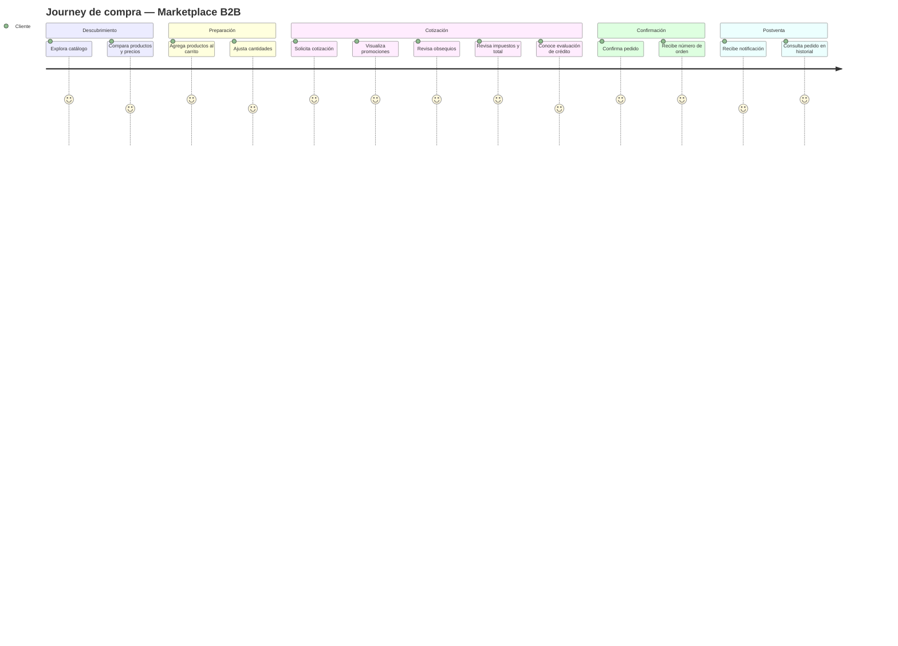
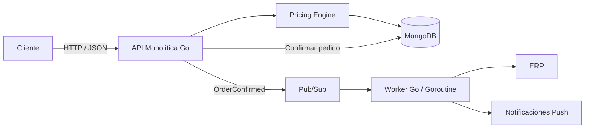

# Prueba Técnica Tech Lead — Discovery y Diseño de Solución

[MariposaMarket · ADR de una página](adr.html) · [Descargar PDF](ADR.pdf)

## Marketplace B2B Multi-tenant — Motor de Precios y Confirmación de Pedidos

> **Objetivo del documento**  
> Consolidar el Discovery funcional y técnico de la solución propuesta para la prueba técnica: problema, flujo funcional, journey del cliente, dominio y reglas de negocio, casos de uso, estrategia de pruebas, casos golden, orden de aplicación de palancas comerciales y stack tecnológico.

---

# 1. Descripción del problema

La plataforma corresponde a un **marketplace B2B multi-tenant y multi-país** donde tenderos compran productos a distribuidores de bebidas.

El journey principal de compra es:

```text
Catálogo → Carrito → Checkout / Cotización → Confirmación → Historial
```

Sobre un mismo pedido pueden coexistir distintas **palancas comerciales**:

- Descuento por escala.
- Combo.
- Obsequio.
- Impuestos.
- Cupo de crédito.

La solución debe resolver dos problemas principales:

## 1.1. Motor de cálculo del pedido

Dado un carrito y un conjunto de reglas comerciales vigentes, el sistema debe calcular:

- Subtotal bruto.
- Descuentos aplicados.
- Origen de cada descuento.
- Combos.
- Obsequios y sus cantidades.
- Base gravable.
- Impuestos.
- Total a pagar.
- Evaluación del cupo de crédito.

El resultado debe ser **explicable**, es decir, no basta con entregar un total: el cliente debe poder entender cómo se obtuvo.

## 1.2. Confirmación confiable del pedido

La confirmación debe garantizar que:

1. El total confirmado sea exactamente el mismo que el total cotizado.
2. Los reintentos no creen pedidos duplicados.
3. El cupo de crédito no se consuma dos veces.
4. Si se responde `201 Created`, la orden ya exista y pueda consultarse.
5. Luego de confirmar el pedido, se publique un evento para integraciones externas.
6. ERP y Notificaciones Push se procesen de forma desacoplada respecto de la confirmación del pedido.

## 1.3. Invariantes principales

```text
I1. Quote.total == Order.total

I2. HTTP 201 => Order existe y es consultable

I3. Misma Idempotency-Key + mismo request => misma Order

I4. Una intención lógica de compra => un único consumo de crédito

I5. El dinero nunca usa aritmética floating point

I6. Cada descuento o beneficio debe ser trazable a su regla de origen

I7. País, moneda, escala decimal e impuestos no deben estar hardcodeados

I8. Pedido confirmado => evento de pedido confirmado publicable hacia Pub/Sub
```

---

# 2. Diagrama funcional

```mermaid
flowchart LR
    A[Cliente explora catálogo] --> B[Agrega productos al carrito]
    B --> C[Solicita cotización]

    C --> D[Calcular precios]
    D --> E[Aplicar promociones]
    E --> F[Determinar obsequios]
    F --> G[Calcular impuestos]
    G --> H[Evaluar crédito]
    H --> I[Generar resumen de cotización]

    I --> J{Cliente confirma?}

    J -- No --> B
    J -- Sí --> K[Validar solicitud e idempotencia]

    K --> L{Crédito válido?}
    L -- No --> M[Informar rechazo]
    L -- Sí --> N[Crear pedido]

    N --> O[Consumir crédito]
    O --> P[Guardar pedido confirmado]
    P --> Q[Publicar evento OrderConfirmed en Pub/Sub]
    Q --> R[Worker Go consume evento]

    R --> S[Enviar pedido al ERP]
    R --> T[Enviar notificación Push]

    P --> U[Pedido disponible en historial]
```



## 2.1. Lectura funcional del flujo

1. El cliente construye su carrito.
2. Solicita una cotización.
3. El sistema calcula beneficios, impuestos y crédito.
4. El cliente revisa el resumen antes de comprar.
5. Al confirmar, el sistema valida idempotencia y crédito.
6. La orden se persiste antes de entregar una respuesta exitosa.
7. Una vez confirmada, la API publica un evento.
8. Un worker en Go consume el evento desde Pub/Sub.
9. El worker integra con ERP y Notificaciones Push.
10. La orden confirmada queda disponible en historial.

---

# 3. Journey del cliente



## 3.1. Momentos clave del Journey

| Momento | Expectativa del cliente | Riesgo | Respuesta de diseño |
|---|---|---|---|
| Cotización | Entender cuánto pagará | Total opaco | Breakdown completo |
| Promociones | Entender el beneficio recibido | Descuento inexplicable | Origen de cada ajuste |
| Confirmación | Pagar exactamente lo cotizado | Precio diferente al confirmar | Quote Snapshot |
| Reintento | No duplicar la compra | Doble tap / mala red | Idempotency-Key |
| Crédito | Saber si puede comprar | Sobreconsumo concurrente | Validación y consumo atómico |
| Confirmación | Tener certeza de compra | `201` sin orden persistida | Responder después de persistir |
| Historial | Encontrar su pedido | Pedido “desaparece” | Orden consultable inmediatamente |

---

# 4. Dominio de negocio

## 4.1. Agregados y entidades principales

### Customer

Representa al comprador B2B.

```text
Customer
- id
- tenantId
- country
- creditAccount
```

### Product

```text
Product
- sku
- description
- family
- unitPrice
- taxCategory
```

### Cart

```text
Cart
- customerId
- tenantId
- country
- items[]
```

### CartItem

```text
CartItem
- sku
- quantity
```

### Promotion

Representa una palanca comercial.

```text
Promotion
- id
- type
- priority
- eligibility
- compatibility
- validFrom
- validTo
```

Tipos iniciales:

```text
SCALE
COMBO
GIFT
```

### Quote

Representa la cotización calculada y aceptable por el cliente.

```text
Quote
- quoteId
- tenantId
- country
- customerId
- currency
- lines[]
- adjustments[]
- gifts[]
- grossSubtotal
- taxableBase
- taxTotal
- total
- creditEvaluation
- createdAt
```

### Order

```text
Order
- orderId
- orderNumber
- quoteId
- customerId
- tenantId
- status
- total
- createdAt
```

### CreditAccount

```text
CreditAccount
- customerId
- availableAmount
- currency
```

### OrderConfirmedEvent

```text
OrderConfirmedEvent
- eventId
- orderId
- orderNumber
- customerId
- tenantId
- total
- currency
- occurredAt
```

---

# 5. Reglas de negocio

## RN01 — Dinero exacto

No se debe utilizar `float32` ni `float64` para representar dinero.

El tipo monetario debe encapsular:

```text
Money
- amount
- currency
- scale
```

La política de redondeo debe ser explícita y configurable por país/moneda.

---

## RN02 — Configuración multi-país

Los siguientes valores no deben quedar hardcodeados en el motor:

- Moneda.
- Escala decimal.
- Regla de redondeo.
- Tasas tributarias.
- Configuración comercial específica del país.

---

## RN03 — Cotización determinística

Para el mismo:

```text
Carrito + Configuración + Reglas + Precios
```

el resultado debe ser el mismo.

---

## RN04 — Quote Snapshot

Una vez generada la cotización, el resultado económico utilizado para confirmar el pedido debe mantenerse inmutable.

```text
Quote.total == Order.total
```

La confirmación no debe recalcular el pedido usando nuevos precios o promociones.

---

## RN05 — Descuento por escala

Las escalas son acumulativas por tramos.

Ejemplo:

```text
1 - 5 unidades    : 0%
6 - 10 unidades   : 5%
11+ unidades      : 10%
```

Para 12 unidades:

```text
1 - 5   => 0%
6 - 10  => 5%
11 - 12 => 10%
```

---

## RN06 — Combo

Los productos y cantidades usados para activar un combo deben quedar asociados al combo.

Por defecto, esas mismas unidades no deben recibir adicionalmente un descuento suelto por escala.

---

## RN07 — Obsequio

Cuando se cumpla la condición comercial:

- El SKU regalado debe aparecer explícitamente.
- Debe indicarse la cantidad.
- El valor comercial puede ser cero para el cliente.
- Su tratamiento tributario debe depender de la configuración del país/regla.

---

## RN08 — Impuestos

Los impuestos se calculan sobre la base gravable resultante **después de descuentos comerciales**.

```text
Subtotal bruto
- descuentos comerciales
= base gravable
```

Luego:

```text
base gravable × tasa = impuesto
```

---

## RN09 — Crédito

Si el medio de pago es crédito:

```text
Order.total <= Credit.available
```

La validación y consumo deben evitar sobreconsumo ante solicitudes concurrentes.

---

## RN10 — Idempotencia

`POST /orders` debe recibir una `Idempotency-Key`.

```text
Misma key + mismo request
=> misma orden
```

```text
Misma key + request diferente
=> conflicto
```

---

## RN11 — Confirmación

La API solo debe devolver `201 Created` cuando la orden haya sido persistida correctamente.

---

## RN12 — Evento de pedido confirmado

Solo se publica `OrderConfirmed` cuando la orden alcanzó estado `CONFIRMED`.

El evento no debe representar un intento de confirmación sino un hecho ya ocurrido.

---

# 6. Casos de uso

## UC01 — Solicitar cotización

**Actor:** Cliente.

### Entrada

- Tenant.
- País.
- Cliente.
- Carrito.
- Medio de pago.

### Flujo principal

1. Validar solicitud.
2. Obtener contexto de país y tenant.
3. Obtener precios.
4. Obtener promociones vigentes.
5. Ejecutar el motor de precios.
6. Determinar obsequios.
7. Calcular base gravable.
8. Calcular impuestos.
9. Evaluar crédito.
10. Generar Quote Snapshot.
11. Retornar breakdown.

### Resultado

- `quoteId`.
- Líneas.
- Promociones.
- Obsequios.
- Impuestos.
- Total.
- Estado del crédito.

---

## UC02 — Confirmar pedido

**Actor:** Cliente.

### Precondiciones

- Existe una cotización.
- Existe `Idempotency-Key`.

### Flujo principal

1. Validar idempotencia.
2. Recuperar Quote Snapshot.
3. Validar disponibilidad de crédito.
4. Crear orden usando el snapshot.
5. Consumir crédito.
6. Persistir la orden.
7. Marcarla `CONFIRMED`.
8. Publicar `OrderConfirmed`.
9. Responder `201 Created`.

### Postcondición

```text
201 => Order persistida y consultable
```

---

## UC03 — Consultar pedido

**Actor:** Cliente.

### Entrada

`orderId`

### Resultado

Información de la orden confirmada.

---

## UC04 — Procesar pedido confirmado

**Actor:** Worker en Go.

### Trigger

Evento `OrderConfirmed` disponible en Pub/Sub.

### Flujo

1. Consumir evento.
2. Validar estructura.
3. Procesar de manera idempotente.
4. Enviar pedido hacia ERP.
5. Enviar Notificación Push.
6. Confirmar procesamiento del mensaje.

---

# 7. Casos de prueba

## 7.1. Casos funcionales

| ID | Caso | Resultado esperado |
|---|---|---|
| CF01 | Carrito sin promociones | Total = subtotal + impuestos |
| CF02 | Descuento por escala | Aplicar descuentos por tramo |
| CF03 | Combo válido | Aplicar precio/beneficio combo |
| CF04 | Obsequio válido | Mostrar SKU y cantidad gratis |
| CF05 | Pedido con impuestos | Impuesto calculado sobre base gravable |
| CF06 | Crédito suficiente | Pedido elegible |
| CF07 | Crédito insuficiente | Pedido no elegible |
| CF08 | Confirmar quote | Order.total = Quote.total |
| CF09 | Retry misma idempotency key | Misma orden |
| CF10 | Consultar orden confirmada | `200` y orden encontrada |

---

# 8. Casos de borde

## CB01 — Carrito vacío

**Entrada:** `items=[]`

**Esperado:** rechazo de validación.

---

## CB02 — Cantidad cero

```text
quantity = 0
```

**Esperado:** rechazo.

---

## CB03 — Cantidad negativa

**Esperado:** rechazo.

---

## CB04 — SKU inexistente

**Esperado:** error de dominio / producto no encontrado.

---

## CB05 — Promoción expirada

**Esperado:** no debe aplicarse.

---

## CB06 — Combo incompleto

Si falta cualquier cantidad mínima necesaria:

**Esperado:** combo no aplicado.

---

## CB07 — Exactamente en el límite de un tramo

Ejemplo:

```text
quantity = 10
```

Validar que la distribución entre tramos sea exacta.

---

## CB08 — Unidades excedentes al combo

Ejemplo:

```text
Combo requiere 2A + 1B

Carrito:
5A + 2B
```

Validar cuántos combos se aplican y qué unidades quedan disponibles para otras reglas.

---

## CB09 — Múltiples promociones candidatas

Validar:

- prioridad;
- compatibilidad;
- unidades consumidas;
- no doble descuento.

---

## CB10 — Impuesto con resultado decimal límite

Ejemplos:

```text
0.005
1.005
10.015
```

Validar política de rounding.

---

## CB11 — Crédito exactamente igual al total

```text
credit.available == order.total
```

**Esperado:** permitido.

---

## CB12 — Crédito menor por una unidad mínima

Ejemplo:

```text
total = 100.01
credit = 100.00
```

**Esperado:** rechazo.

---

## CB13 — Quote cambiado después de cotizar

Cambiar:

- precio;
- promoción;
- impuesto configurado;

antes de confirmar.

**Esperado:** se conserva el valor del snapshot.

---

## CB14 — Misma idempotency key con payload diferente

**Esperado:** `409 Conflict`.

---

## CB15 — Evento duplicado en Pub/Sub

**Esperado:** worker no debe producir efectos de negocio duplicados.

---

# 9. Casos límite

## CL01 — Cantidad máxima aceptada por línea

Definir un límite técnico configurable.

El motor debe:

- validar antes de procesar;
- evitar overflow;
- mantener tiempo de cálculo controlado.

---

## CL02 — Máximo de líneas por carrito

Ejemplo propuesto para la prueba:

```text
100 líneas
```

> Este valor es una **meta propuesta para el take-home**, no un requisito explícito del enunciado.

---

## CL03 — Máximo número de promociones aplicables

El motor debe poder procesar múltiples reglas sin generar doble aplicación sobre las mismas unidades.

---

## CL04 — Montos monetarios grandes

Probar cercanía al máximo soportado por el tipo decimal elegido.

---

## CL05 — Gran cantidad de reintentos

```text
N retries con misma Idempotency-Key
=> una sola orden
```

---

# 10. Casos de rendimiento

> El enunciado no entrega un SLA o throughput explícito. Los siguientes objetivos son **metas propuestas para la prueba**, enfocadas en detectar regresiones evidentes y demostrar criterio de ingeniería.

## CR01 — Pricing de carrito representativo

**Entrada propuesta:**

- 100 líneas.
- 20 promociones.
- Mezcla de combo, escala y obsequios.

**Objetivo:**

El cálculo debe ser determinístico y completar sin degradación significativa en ambiente local.

---

## CR02 — Cotizaciones concurrentes

Ejecutar múltiples solicitudes simultáneas de `POST /quotes`.

Validar:

- cero corrupción de datos;
- cero resultados no determinísticos;
- ausencia de race conditions.

---

## CR03 — Confirmaciones concurrentes sobre mismo crédito

Dos pedidos simultáneos compiten por un cupo que permite solo uno.

**Esperado:**

```text
1 confirmada
1 rechazada
```

Nunca ambas.

---

## CR04 — Reintentos concurrentes de la misma orden

Varias solicitudes con la misma `Idempotency-Key`.

**Esperado:**

```text
1 Order
1 consumo de crédito
```

---

## CR05 — Consumo sostenido de Pub/Sub

Publicar múltiples `OrderConfirmed`.

Validar:

- el worker continúa consumiendo;
- no bloquea la API;
- eventos fallidos pueden reintentarse;
- no existen efectos duplicados ante redelivery.

---

# 11. Casos Golden obligatorios

Los Golden Tests representan escenarios de negocio cuyo resultado debe permanecer estable ante refactors.

## GT01 — Descuento por escala en dos tramos

### Escenario

Un SKU alcanza dos tramos con descuento.

### Validar

- unidades asignadas correctamente;
- descuento de cada tramo;
- descuento total;
- total final.

---

## GT02 — Combo sin descuento suelto duplicado

### Escenario

Los productos activan un combo.

### Validar

- combo aplicado;
- origen visible;
- unidades consumidas por el combo;
- mismas unidades no aparecen también como descuento individual.

---

## GT03 — Obsequio

### Escenario

La compra cumple una condición que genera producto gratis.

### Validar

```text
gift.sku
gift.quantity
```

y presencia en el breakdown.

---

## GT04 — Combo con impuestos

### Validar

```text
combo
→ base gravable
→ impuesto
→ total
```

El impuesto debe formar parte del total.

---

## GT05 — Crédito excedido

### Escenario

```text
order.total > availableCredit
```

### Esperado

Pedido no elegible para crédito.

---

## GT06 — Regresión Quote / Order

### Escenario

1. Cotizar carrito.
2. Guardar quote.
3. Modificar precios/promociones vigentes.
4. Confirmar utilizando `quoteId`.

### Assert principal

```text
Quote.total == Order.total
```

---

# 12. Casos Golden adicionales recomendados

## GT07 — Idempotencia

```text
100 retries
=> 1 order
```

---

## GT08 — Crédito concurrente

Dos confirmaciones compiten por el mismo saldo.

```text
Solo una debe confirmar.
```

---

## GT09 — Rounding

Validar valores límite de decimal y tasas.

---

## GT10 — Multi-país

Mismo carrito con dos configuraciones de país.

Validar:

- moneda;
- escala;
- impuestos;
- rounding.

---

## GT11 — Evento OrderConfirmed

Confirmar pedido.

Validar que solo después del estado `CONFIRMED` exista publicación hacia Pub/Sub.

---

# 13. Orden de aplicación de palancas

## 13.1. Decisión

El orden propuesto es:

```text
1. Resolver contexto Tenant / País
          ↓
2. Resolver precios base
          ↓
3. Detectar y asignar Combos
          ↓
4. Aplicar descuentos por Escala
   sobre unidades elegibles restantes
          ↓
5. Determinar Obsequios
          ↓
6. Calcular Base Gravable
          ↓
7. Calcular Impuestos
          ↓
8. Calcular Totales
          ↓
9. Evaluar Cupo de Crédito
          ↓
10. Generar Quote Snapshot
```

---

# 14. Justificación del orden de palancas

La decisión se basa en las perspectivas levantadas durante el Discovery con dos perfiles de negocio.

## 14.1. Perspectiva de Gerencia de Marketing Digital

La mirada de Marketing prioriza:

- que el beneficio sea visible;
- que las promociones sean explicables;
- que el cliente confíe en el precio;
- que las campañas puedan coexistir bajo reglas claras;
- que se conozca qué promociones son acumulables y cuáles excluyentes.

Esto implica que el motor debe mantener trazabilidad de:

```text
Qué regla se aplicó
Sobre qué unidades
Qué beneficio produjo
Qué reglas quedaron excluidas
```

### Efecto en el orden

**Combo antes que descuento por escala**.

Un combo consume un conjunto concreto de productos y cantidades. Si primero se aplica un descuento individual y luego se arma un combo con las mismas unidades, el cliente podría recibir un beneficio duplicado no intencional y el breakdown sería difícil de explicar.

Por eso:

```text
Combo
→ reserva/asigna unidades
→ Scale Discount solo sobre unidades restantes elegibles
```

---

## 14.2. Perspectiva del Product Owner B2B

La mirada de Producto prioriza:

1. Un motor mínimo pero confiable.
2. Journey completo antes que sofisticación innecesaria.
3. Que el precio mostrado se respete al confirmar.
4. Que el crédito represente correctamente la capacidad real de compra.

### Efecto en el orden

**Impuestos después de descuentos** porque la base gravable debe reflejar el precio comercial resultante.

**Crédito después del total** porque solo puede evaluarse cuando ya se conoce el valor definitivo del pedido.

**Quote Snapshot al final** porque debe persistir exactamente el resultado completo que el cliente visualizó.

---

# 15. ¿Por qué este orden es correcto?

## 15.1. Evita double dipping

```text
Unidades usadas por combo
≠
unidades disponibles automáticamente para otro beneficio
```

---

## 15.2. Mantiene trazabilidad comercial

Cada ajuste conoce:

- promoción;
- tipo;
- unidades;
- monto;
- origen.

---

## 15.3. Permite explicar el precio

El cliente puede recorrer:

```text
Precio base
→ beneficio comercial
→ obsequios
→ impuestos
→ total
```

---

## 15.4. Calcula correctamente impuestos

La base gravable se determina después de los descuentos comerciales.

---

## 15.5. Evalúa crédito sobre el valor correcto

No se consulta crédito contra subtotal bruto, sino contra el valor final que efectivamente se intentará confirmar.

---

## 15.6. Protege Quote = Order

El snapshot se crea únicamente una vez que el cálculo terminó.

```text
Pricing completo
→ Quote Snapshot
→ Confirm Order sin recalcular
```

---

# 16. Stack tecnológico

## 16.1. Backend

### Go

Uso propuesto:

```text
Go
└── API REST monolítica modular
```

Motivos:

- tipado estático;
- simplicidad;
- buen soporte para concurrencia;
- bajo overhead;
- facilidad para mantener un core de dominio independiente del framework.

---

## 16.2. Arquitectura

```text
Modular Monolith
+
Clean Architecture / Ports & Adapters
```

Módulos principales:

```text
HTTP Handlers
Application / Use Cases
Domain
Repositories
Messaging
Integrations
```

Se evita separar prematuramente en microservicios.

---

## 16.3. Base de datos

### MongoDB

Uso:

- productos;
- clientes;
- promociones;
- quotes;
- orders;
- idempotency records.

Motivos para la prueba:

- modelo documental alineado con snapshots;
- rápida ambientación;
- baja fricción de desarrollo;
- integración directa con Docker Compose.

### Consideración importante

Las operaciones críticas de confirmación deben diseñarse cuidando atomicidad y concurrencia.

Cuando una operación requiera consistencia entre múltiples documentos/colecciones, se evaluará el uso de:

- transacciones MongoDB;
- actualización condicional atómica;
- restricciones/índices únicos.

---

## 16.4. Mensajería

### Pub/Sub

Topic principal:

```text
orders-confirmed
```

Flujo:

```text
API confirma Order
      ↓
Publica OrderConfirmed
      ↓
Pub/Sub
      ↓
Worker Go
      ↓
ERP
+
Push
```

Para desarrollo local se puede utilizar:

```text
Pub/Sub Emulator
```

---

## 16.5. Worker

El consumidor se implementará en Go como **goroutine** administrada por la aplicación.

Responsabilidades:

- suscribirse al topic;
- consumir eventos;
- validar payload;
- procesar redelivery de manera idempotente;
- enviar a ERP;
- enviar Push;
- ack/nack según resultado.

La goroutine debe respetar:

```text
context.Context
graceful shutdown
retry controlado
logging
```

---

## 16.6. Contenedores

### Docker Compose

Servicios propuestos:

```text
api
mongo
pubsub-emulator
mongo-express (opcional)
```

Todos conectados mediante una red Docker interna.

---

## 16.7. Front

Opcional:

- Angular.

Solo se desarrollará después de:

```text
Pricing correcto
Golden Tests
Quote = Order
Idempotencia
Crédito consistente
```

---

## 16.8. Testing

### Go estándar

```text
testing
```

Opcional:

```text
testify
```

Tipos:

- unitarios;
- golden tests;
- integración;
- concurrencia;
- regresión;
- performance básico.

---

# 17. Estructura de proyecto sugerida

```text
/cmd
  /api
    main.go

/internal
  /domain
    money.go
    product.go
    promotion.go
    quote.go
    order.go
    credit.go

  /application
    /quote
      calculate_quote.go
    /order
      confirm_order.go
      get_order.go

  /pricing
    engine.go
    combo.go
    scale_discount.go
    gift.go
    tax.go

  /repository
    mongo_product.go
    mongo_quote.go
    mongo_order.go
    mongo_credit.go
    mongo_idempotency.go

  /messaging
    publisher.go
    subscriber.go
    order_confirmed_worker.go

  /integration
    erp.go
    push.go

  /http
    quote_handler.go
    order_handler.go

/config
/docker-compose.yml
/README.md
/ADR.md
/Makefile
```

---

# 18. Flujo técnico resumido



---

# 19. Criterios de éxito

La solución se considera satisfactoria si demuestra:

```text
✓ Pricing correcto y explicable
✓ Golden Tests ejecutables
✓ Quote.total == Order.total
✓ Idempotencia
✓ Crédito consistente
✓ Sin floating point para Money
✓ Multi-país configurable
✓ 201 solo después de persistir
✓ OrderConfirmed publicado solo luego de confirmar
✓ Worker desacoplado para ERP y Push
✓ Código ejecutable con un comando simple
✓ README y ADR claros
```

---

# 20. Decisiones conscientemente simplificadas para el take-home

Para mantener foco en el problema de negocio:

- No se desplegará Kubernetes.
- No se implementará Kafka.
- No se diseñará infraestructura cloud productiva.
- No se implementará un motor genérico de promociones ilimitado.
- No se intentará `exactly-once` distribuido.
- No se implementará un ERP real.
- No se implementará un proveedor Push real.

El objetivo es demostrar:

```text
Correctitud
→ Consistencia
→ Testabilidad
→ Simplicidad
→ Extensibilidad
```

antes que complejidad de infraestructura.
