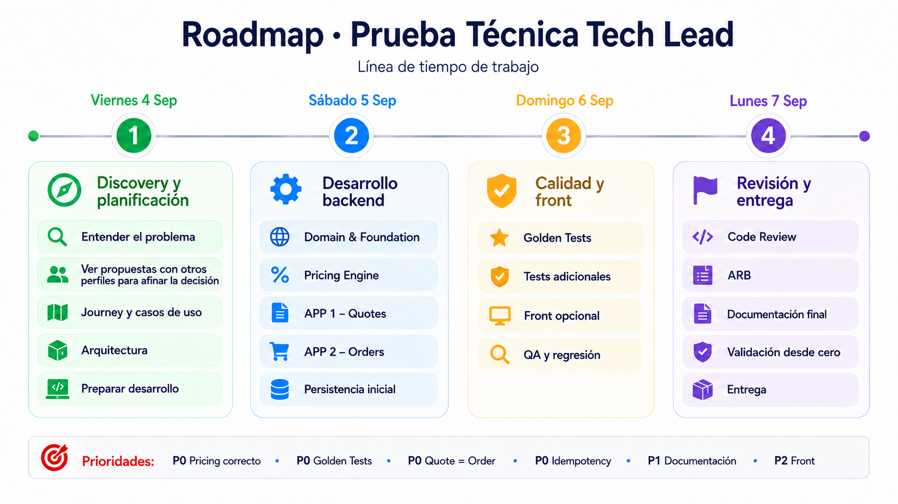
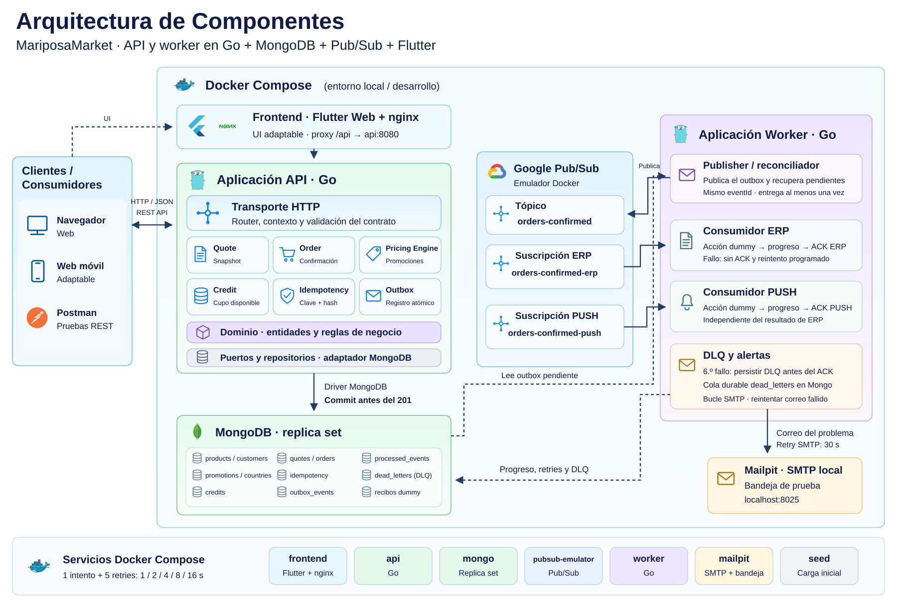

# Marketplace B2B · MariposaMarket

Backend Go con precios, promociones, crédito y pedidos; frontend Flutter Web minimalista y adaptable.

```sh
docker compose up --build -d
```

- **Tienda:** http://localhost:3000
- **API:** http://localhost:8080
- **Estado:** http://localhost:3000/api/ready
- **Correo de prueba (DLQ):** http://localhost:8025

Requiere Docker con contenedores Linux. El seed se carga automáticamente. Se conserva el volumen Mongo del proyecto `backend`.

La suite completa se ejecuta desde la raíz con **un solo comando** (Node.js 20 o superior; CI usa 22, Docker Compose y acceso a Internet):

```sh
node scripts/test.mjs
```

Construye las imágenes y verifica formato/análisis Go y Dart, pruebas Go con integración y detector de carreras, Flutter y ocho golden, nueve recorridos Chrome, recuperación de outbox y DLQ/correo. Instala las dependencias npm y Chrome; en Linux, la instalación de dependencias del navegador puede requerir privilegios de administrador. Usa un proyecto Compose nuevo, volúmenes propios y puertos libres; elimina sus contenedores y volúmenes al terminar, incluso si una prueba falla. La demo existente conserva sus datos. Los resultados y logs quedan en `reports/marketplace-test-*/tests.log`, con evidencias de navegador/Flutter si fallan. Seguridad y complejidad se ejecutan por separado en CI; comandos en [ci/README.md](ci/README.md).

Roadmap


Detalles de ejecución, arquitectura, pruebas y límites: [frontend](frontend/README.md), [backend](backend/README.md), [documentación del desafío](Documentation/Readme.md). [ADR de una página](Documentation/adr.html) · [PDF](Documentation/ADR.pdf).



[Descargar arquitectura en PNG](Documentation/images/arquitectura.png).

[Colección de Postman y entorno](backend/contracts/postman/README.md) · [Worker, reintentos y DLQ](backend/worker/README.md).

Integración continua: [workflow de pruebas, sintaxis, complejidad y seguridad](.github/workflows/ci.yml). Consulta los controles y la evidencia local e histórica en [ci/README.md](ci/README.md). El estado de una ejecución anterior no acredita los cambios todavía sin publicar.

Para repetir o retomar esta app con IA, usa el skill [MariposaMarket](.agents/skills/mariposa-marketplace/SKILL.md): `Usa $mariposa-marketplace para preparar la app y ejecutar su validación completa`. Sustituye el antiguo archivo `backend/instruccion.txt` y se versiona con el proyecto.
