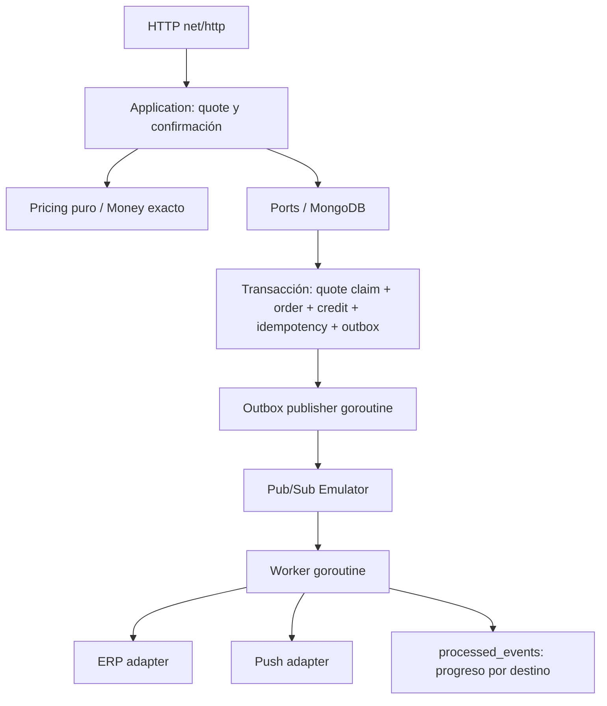

# Marketplace Order Engine

Backend ejecutable de la prueba técnica: Go, API REST, MongoDB con transacciones, outbox y Google Pub/Sub Emulator. El punto de entrada es `cmd/api`; `cmd/seed` carga el escenario de demostración. La interfaz Flutter Web está en [`../frontend`](../frontend/README.md); el Compose de la raíz levanta el conjunto en `http://localhost:3000`.

## Contexto, problema y objetivos

Un tendero cotiza bebidas de un distribuidor en un marketplace B2B multi-tenant y multi-país. Combos, descuentos por tramos, obsequios, impuestos y crédito deben producir un resultado explicable. Al confirmar se conserva el precio visto, se evita comprar dos veces por un reintento y se registra un evento recuperable.

Journey: catálogo → carrito → `POST /quotes` → revisión → `POST /orders` → `GET /orders/{id}`. Catálogo y reglas se cargan como datos; esta entrega no agrega una API administrativa.

## Arquitectura y stack



- `internal/domain`: Money, entidades, eventos y errores.
- `internal/pricing`: cálculo determinista, sin HTTP ni base de datos.
- `internal/application`: generar/persistir snapshot y preparar confirmación.
- `internal/ports`: interfaces pequeñas para persistencia y destinos.
- `internal/repository/mongo`: repositorios, índices, transacción y leases del worker.
- `internal/http`: validación del contrato, scope y errores.
- `internal/messaging`: cliente REST del emulador, outbox y consumidor.
- `internal/integration`: adaptadores HTTP o mocks con recibos persistentes.
- `internal/testkit`: dobles en memoria exclusivos de pruebas; la aplicación real siempre usa MongoDB.

Go 1.25 o superior, librería estándar y MongoDB Go Driver v2. Docker Compose usa un MongoDB 8.0 de un nodo configurado como replica set. Pub/Sub se usa únicamente con su emulador local, por HTTP REST; no se necesitan credenciales ni recursos cloud.

## Cómo ejecutar desde cero

Requisito recomendado: Docker Engine/Desktop con Compose v2 y contenedores Linux.

```sh
cd backend
docker compose up --build -d
docker compose logs -f api
curl http://localhost:8080/ready
```

También: `make docker-up`. Compose inicia el replica set, espera a que tenga un primario, ejecuta el seed y arranca la API. La API espera hasta 60 segundos por el emulador y crea el topic y la subscription. Si una descarga inicial tarda o el emulador no llega a estar disponible, consultar los logs y reiniciar `docker compose up -d api`.

El seed usa `$setOnInsert`: repetirlo no restaura el crédito gastado ni sobrescribe precios modificados. Los datos viven en el volumen `mongo-data`. `docker compose down` detiene el entorno y conserva los datos.

Para ejecutar Go en el host:

```sh
docker compose up -d mongo pubsub-emulator
# Exportar las variables de .env.example en la shell; Go no carga .env automáticamente.
go run ./cmd/seed
go run ./cmd/api
```

Los valores por defecto funcionan contra los puertos locales. El URI del host incluye `directConnection=true` porque el replica set anuncia el nombre Docker `mongo`. `.env` lo interpreta Compose para sus variables; nunca se guarda en Git.

## API Contracts v1

Colección ejecutable de [Postman y entorno Docker local](contracts/postman/README.md): cotizaciones, compra, idempotencia, seis países, crédito insuficiente y validaciones del contrato, con variables y aserciones automáticas.

OpenAPI 3.1 en `contracts/openapi.json`; ejemplos versionados en `contracts/http/`; evento y JSON Schema en `contracts/events/`. Los UUID y fechas de ejemplo son ilustrativos: usar el `quoteId` devuelto por la API. Un test compara el ejemplo de quote contra el motor y el seed.

Todas las rutas de negocio requieren:

```text
X-Tenant-ID: tenant-demo
X-Country: PE
X-Customer-ID: CUSTOMER-001
```

Estos headers representan un contexto **de demostración**, no autenticación. En producción deben derivarse de una identidad verificada por el servidor. Los repositorios filtran tenant, país y cliente; el cuerpo no puede sobrescribir el contexto de los headers.

| Endpoint | Resultado |
|---|---|
| `POST /quotes` | 201, snapshot persistido y header Location |
| `GET /quotes/{id}` | 200, snapshot original, aunque haya expirado |
| `POST /orders` | 201, pedido ya persistido; requiere Idempotency-Key UUID |
| `GET /orders/{id}` | 200, pedido del scope indicado |
| `GET /health` | 200, proceso activo |
| `GET /ready` | 200 si Mongo y subscription están disponibles; 503 si no |

### Ejemplos curl

```sh
curl -i http://localhost:8080/quotes \
  -H 'Content-Type: application/json' \
  -H 'X-Tenant-ID: tenant-demo' -H 'X-Country: PE' \
  -H 'X-Customer-ID: CUSTOMER-001' \
  --data-binary @contracts/http/quote-request.json

# Reemplazar QUOTE_ID por el UUID de la respuesta anterior.
curl -i http://localhost:8080/orders \
  -H 'Content-Type: application/json' \
  -H 'X-Tenant-ID: tenant-demo' -H 'X-Country: PE' \
  -H 'X-Customer-ID: CUSTOMER-001' \
  -H 'Idempotency-Key: 42fe1dba-15e2-463c-b993-70dacfa3b3b3' \
  -d '{"quoteId":"QUOTE_ID","customerId":"CUSTOMER-001"}'

curl http://localhost:8080/orders/ORDER_ID \
  -H 'X-Tenant-ID: tenant-demo' -H 'X-Country: PE' \
  -H 'X-Customer-ID: CUSTOMER-001'
```

En PowerShell usar `curl.exe`, o ejecutar `./scripts/smoke.ps1`, que encadena cotización, confirmación, retry y consulta sin copiar UUID.

### Errores

```json
{"code":"CREDIT_INSUFFICIENT","message":"available credit is insufficient","traceId":"UUID"}
```

400: `INVALID_REQUEST` (incluye cuerpo mal formado, contexto faltante o distinto, cantidad inválida, campo desconocido). 404: `PRODUCT_NOT_FOUND`, `QUOTE_NOT_FOUND`, `ORDER_NOT_FOUND`. 409: `QUOTE_INVALID`, `CREDIT_INSUFFICIENT`, `IDEMPOTENCY_CONFLICT`. 500: `INTERNAL_ERROR` con detalle solamente en logs. El cuerpo está limitado a 1 MiB. Carritos de 1–100 líneas, SKU único por línea, cantidades enteras de 1–1.000.000, pago `CASH` o `CREDIT`.

## Pricing Engine y orden de palancas

Contexto → precios base → **COMBO → SCALE → GIFT → base gravable → impuestos → total → crédito → snapshot**.

La decisión sigue las perspectivas del discovery:

- **Marketing:** promociones visibles, beneficios comprensibles y cada ajuste vinculado a su campaña.
- **Producto B2B:** un journey confiable, respeto del precio cotizado y crédito correcto.

Un combo reserva unidades y distribuye su descuento entre líneas proporcionalmente al valor base; el residuo de redondeo se asigna determinísticamente manteniendo el descuento exacto. `comboQuantity` y los ajustes identifican esas unidades. Los tramos de escala se aplican únicamente al saldo de unidades, desde el primer tramo sobre ese saldo. En esta versión no se permite acumular SCALE sobre unidades de COMBO.

Escala acumulativa: unidades 1–5 a 0%, 6–10 a 5%, 11+ a 10%. Para 12 unidades a 100 unidades menores: descuento = 5×100×5% + 2×100×10% = 45, no 120. Cada tramo genera un ajuste con `promotionId`, tipo, SKU y cantidad.

Para una escala por **familia**, se suman las unidades elegibles que quedan después de los combos. Los tramos se asignan por SKU ascendente, independiente del orden del carrito; cada porción usa el precio del SKU y se redondea por tramo/SKU. Con A3+B3, el sexto lugar corresponde a B. No se busca maximizar el descuento mediante el orden de entrada. Si la escala beneficia al grupo, reserva también sus unidades del tramo de 0 %, evitando reutilizarlas en una segunda escala. Una regla por SKU mantiene sus tramos individuales.

Dentro de cada tipo se ordena por `priority` ascendente y después `id`; la primera escala que otorga beneficio ocupa el SKU. `incompatibleWith` excluye campañas a nivel de carrito de forma simétrica al aplicar las reglas. El orden entre tipos siempre prevalece sobre la prioridad. Fechas válidas en intervalo `[validFrom, validTo)`.

Los regalos se calculan sobre las unidades compradas elegibles, incluso si participaron en combo. Incluyen SKU, cantidad, campaña y valor de referencia. `taxGifts` configura si ese valor genera impuesto; no se cobra su precio comercial. La base gravable de líneas pagadas excluye regalos; el impuesto de regalos se detalla en `gifts[].tax` y se agrega a `taxTotal`.

## Money, rounding y multi-country

Representación JSON y BSON explícita:

```json
{"amount":"1363","currency":"PEN","scale":2}
```

Significa **13.63 PEN**. `amount` es una cadena con unidades menores en JSON y un `int64` en Mongo; no es un decimal de unidades mayores. Se evita la pérdida de precisión de JavaScript. Go usa enteros con comprobación de overflow y `math/big` para operaciones intermedias. No se usa floating point para dinero.

`HALF_UP` redondea mitades alejándose de cero; `HALF_EVEN` al entero par. Se redondea cada tramo y cada impuesto por línea; los totales suman resultados ya redondeados. Las tasas se expresan en basis points: 1800 = 18%. Sumas/restas/comparaciones rechazan moneda o escala distinta. Se admiten escalas 0–6.

`countries` configura moneda, escala, redondeo, impuestos por categoría y tratamiento de obsequios para cada tenant/país. El seed incluye PE/PEN/2, CL/CLP/0, CO/COP/2, EC/USD/2, GT/GTQ/2 y AR/ARS/2. Los datos tributarios son **sintéticos de prueba**: los cuatro países nuevos tienen tasa 0 pendiente de configuración comercial. Sus importes nominales de demo no son una conversión cambiaria. Cada país dispone de productos, promociones, cliente y crédito. El seed usa inserción condicional, sin sobrescribir saldos ni pedidos existentes. El motor no contiene condiciones por código de país.

## Quote Snapshot

`Quoted Total == Confirmed Total`. La cotización guarda líneas, promociones aplicadas, impuestos, obsequios, crédito evaluado y fechas. La confirmación lee ese documento y nunca invoca Pricing. Los cambios de precios o campañas no afectan el pedido.

Vigencia por defecto 15 minutos (`QUOTE_TTL`). Una cotización vencida no puede confirmarse por primera vez; se conserva para auditoría. Un retry de un pedido ya confirmado devuelve el resultado guardado incluso si la quote venció posteriormente. Cada quote se confirma una sola vez, también si el cliente intenta usar otra key.

La evaluación de crédito en quote es informativa: una quote no elegible se devuelve con `eligible:false` para que el cliente vea el resultado. En confirmación siempre se revisa el saldo vigente de forma atómica. `CASH` no consume crédito.

## Idempotency y Credit Consistency

Clave única `(tenantId, key)`, hash SHA-256 de los campos normalizados de scope y request, respuesta completa persistida y status 201. Mismo hash: replay. Otro hash: 409. Dos keys para una quote no producen dos pedidos.

MongoDB confirma atómicamente:

1. Reserva del snapshot todavía vigente y no confirmado.
2. Decremento condicional de crédito: saldo ≥ total, moneda y escala compatibles.
3. Inserción del pedido.
4. Registro de idempotencia.
5. Inserción del evento de outbox.

Se usan transacciones con snapshot y write concern majority. Los conflictos de escritura se reintentan mediante el driver; un conflicto de índice de idempotencia consulta el resultado ganador. Ningún fallo parcial consume saldo o deja una reserva de quote huérfana.

## Transactional Outbox, Pub/Sub y Worker

El publisher consulta hasta 50 eventos pendientes cada segundo. Publica y espera la respuesta de Pub/Sub antes de marcar `publishedAt`. Si se cae entre ambos pasos, vuelve a publicar; esto es **at-least-once**. Los eventos permanecen en Mongo durante una indisponibilidad del emulador.

La consulta reconcilia también publicaciones de más de un minuto sin ambos destinos completados. Reenvía el mismo `eventId`; el progreso por destino y los receptores idempotentes evitan repetir efectos. Los eventos completados se filtran antes del límite del lote para que no bloqueen la recuperación. `publishedAt` representa el último intento confirmado por el broker, no el éxito de ERP/PUSH. El adaptador recrea topic/subscription si publish o pull reciben 404 tras reiniciar el emulador.

Topic `orders-confirmed`; subscription `orders-confirmed-worker`, creados automáticamente. El worker consume secuencialmente con ack deadline de 60 segundos y efectos con timeout de 10 segundos. Usa ack después de ambos destinos; falla o mensaje inválido: nack y pausa antes del retry. No confirma pedidos ni los borra ante errores de ERP/Push.

`processed_events` tiene índice único por `eventId`, progreso por destino y leases de un minuto con owner token. Si ERP tuvo éxito y Push falla, el retry continúa con Push. Un lease abandonado vence y puede recuperarse. No se promete exactly-once distribuido: si un destino confirmó y el worker murió antes de guardar el progreso, debe ser el propio destino quien deduplique.

## ERP / Push

Por defecto los adaptadores guardan el efecto simulado en `mock_integration_receipts`, usando `_id=eventId:destino` y upsert de inserción. Es durable y deduplica incluso el caso de respuesta perdida. No contactan sistemas reales.

Al configurar `ERP_BASE_URL` o `PUSH_BASE_URL` se hace POST al URL completo, enviando el evento y `Idempotency-Key: eventId:erp` o `eventId:push`. El receptor debe guardar esa clave junto con su efecto de negocio. Timeouts y respuestas no 2xx se consideran fallos reintentables. El control de concurrencia y los leases locales por sí solos no reemplazan ese contrato del receptor.

## Consistency Model

Order, crédito, idempotencia y outbox: **strong consistency dentro de la transacción**. Integraciones externas: **eventual consistency**. Mensajería: **at-least-once**. 201 significa commit completado y pedido inmediatamente consultable en el primario. Un cliente que pierde la respuesta debe reintentar con la misma key.

## Tests

```sh
go test ./...
go test -race ./...
go vet ./...
# También make verify

# Integración real + race en Linux, sin instalar Go localmente:
docker compose --profile test run --build --rm tests

# Si el entorno ya está levantado, conservar sus contenedores:
docker compose --profile test run --build --no-deps --rm tests

# O desde el host, con Mongo replica set y emulador activos:
export MONGO_TEST_URI='mongodb://localhost:27017/?replicaSet=rs0&directConnection=true'
export PUBSUB_EMULATOR_HOST=localhost:8085
go test -tags=integration -count=1 ./...
```

En Windows el race detector requiere un compilador C compatible en PATH. El target Docker `test` incluye GCC. Las pruebas de integración crean y eliminan una base con nombre aleatorio `marketplace_test_*`; nunca usan la base del demo. Si se selecciona el tag sin las dependencias/variables, fallan explícitamente.

| Caso | Evidencia |
|---|---|
| GT01 | Tramos acumulativos; fixture JSON escrito con resultado esperado |
| GT02 | Combo primero, escala solo sobre excedentes |
| GT03 | Regalo con SKU, cantidad y origen |
| GT04 | Impuesto sobre precio del combo después de descuento |
| GT05 | Quote no elegible por una unidad menor de crédito |
| GT06 | Snapshot confirmado aunque cambien precios/campañas; fixture esperado |
| GT07 | 100 confirmaciones simultáneas, un pedido y un débito |
| GT08 | Dos pedidos compiten, uno confirma y el otro revierte |
| GT09 | 0.005, 1.005, 10.015, HALF_UP / HALF_EVEN y signo negativo |
| GT10 | Configuraciones de dos países sin ramas en Pricing |
| GT11 | Rechazo no crea pedido ni evento; outbox se recupera tras fallo |
| GT12 | Redelivery, concurrencia, éxito parcial y deduplicación por destino |

Casos adicionales: carrito vacío, cero/negativos, SKU inexistente/duplicado, campaña expirada, combo incompleto, límite/excedente de escala, campañas candidatas e incompatibles, impuestos de regalo, crédito exacto, quote antigua, cambio de request con misma key, aislamiento de scope, JSON inválido, recorrido HTTP y cotizaciones concurrentes. Las pruebas Mongo cubren índices y rollback real; la de Pub/Sub publica, consume, republica el mismo eventId y verifica dos recibos totales.

Si Compose recrea el emulador, pierde sus recursos en memoria. El adaptador los recrea al recibir 404; la reconciliación repone publicaciones sin efectos completados después de un minuto, siempre que Mongo conserve outbox y progreso. Las pruebas eliminan únicamente sus propios recursos Pub/Sub para reproducir esa pérdida y comprueban deduplicación y éxito parcial. Usar `--no-deps` evita recreaciones innecesarias del entorno activo.

Si Windows bloquea el script de smoke por su política de ejecución, ejecutarlo en un proceso temporal: `powershell -NoProfile -ExecutionPolicy Bypass -File scripts/smoke.ps1`. Esto no modifica la política persistente del sistema.

## Performance tests y validación local

`make benchmark` mide 100 líneas y 20 campañas, con allocs/op y bytes/op. No existe un SLA oficial. Los resultados ejecutados en el entorno de desarrollo se registran en `VALIDATION.md`; no son garantías productivas.

## Trade-offs y límites

- Monolito y worker en el mismo proceso simplifican operación; publisher y worker tienen `context.Context` y cierre controlado. Primero se drena HTTP, luego se cancelan workers y se cierra Mongo.
- Un Mongo replica set de un nodo permite transacciones locales, pero no alta disponibilidad.
- Catálogo se carga por tenant/país para mantener el adaptador simple; para catálogos grandes conviene consultar únicamente SKU relevantes y campañas aplicables.
- El motor cubre palancas descritas, no una DSL genérica de campañas. La política de acumulación sobre unidades de combo es deliberadamente excluyente.
- Un consumidor secuencial y reintentos fijos son adecuados para el demo. Faltan DLQ y cuarentena de mensajes inválidos: actualmente se reintentan y se registran en logs.
- No se implementan autenticación real, stock, pagos, devolución de crédito, administración de reglas, auditoría fiscal ni retención automática de outbox/idempotencia.
- No se implementaron Kubernetes, Kafka, Redis, service mesh, microservicios, despliegue cloud productivo ni exactly-once distribuido.

## Mejoras para producción

Identidad verificada y autorización; límites por tenant; observabilidad con métricas y trazas; replica set de varios nodos; límites y backoff con jitter/DLQ; retención y archivo; validación administrativa de promociones; catálogo por SKU; contrato de idempotencia comprobado con ERP/Push; migraciones de esquemas; políticas fiscales validadas; TLS y secretos gestionados. El cliente de mensajería actual está acotado al emulador y requiere un adaptador autenticado para cloud.

Referencias de implementación: [transacciones del driver MongoDB](https://www.mongodb.com/docs/drivers/go/current/crud/transactions/), [Pub/Sub Emulator](https://cloud.google.com/pubsub/docs/emulator).
